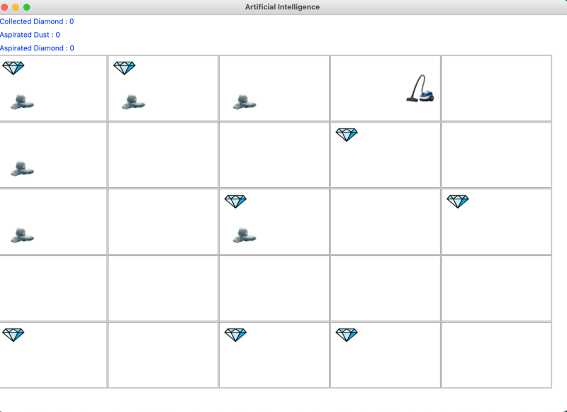

# Intelligence Artificielle

Vous êtes un programmeur engagé dans une entreprise qui construit des robots dotés d'intelligence artificielle pour les activités ménagères. Son noveau projet est de développer un agent intelligent qui composera un aspirateur robot. L'agent/robot s'appellera Aspirobot T-0.1 et ses objectifs sont d'aspirer la poussière d'une résidence et de récupérer les bijoux perdus sur le sol.

### Détail de l'environement

Les maisons dans lesquelles le robot va travailler ont plusieurs pièces. De cette façon, pour simuler l'environnement d'une maison à partir de laquelle le robot travaillera, vous utiliserez une matrice 5x5, où chaque cellule représente une pièce de la maison, totalisant 25 pièces, comme l'illustre l'image ci-dessous. L'environnement sera chargé de contrôler la génération de poussière et des bijoux, de façon sporadique et dans des pièces aléatoires. Pour programmer l'environnement, vous devez utiliser un thread qui exécute une boucle infinie (selon le pseudocode ci-dessous) ou qui déclenche des événements sporadiquement. Vous pouvez choisir la fréquence et la probabilité de génération de poussière et des bijoux. Une pièce peut contenir de la poussière et/ou des bijoux en même temps.
<br />
<br />


### Détails de l'agent

Les fonctions de l'agent Aspirobot T-0.1 sont les suivantes : aspirer (poussière ou poussière et bijou, lorsque les deux sont dans la même pièce), collecter le bijou (lorsque seule le bijou est dans la pièce), déplacer vers le haut, le bas, la gauche et la droite. Le robot ne se déplace pas en diagonale. A chaque cycle d'analyse (boucle), l'agent peut voir toutes les pièces. C'est-à-dire que l'agent est toujours au courant de l'état de l'environnement avant d'exécuter une exploration. Pour cela, l'agent doit observer l'environnement à travers ses capteurs puis effectuer des actions sur l'environnement à travers ses actionneurs. L'agent doit être de type objectif et avoir son état mental modélisé sous la forme d'un état BDI. De plus, pour programmer l'agent, vous devez utiliser un thread qui exécute une boucle infinie

### Algorithme utilisé

L'agent doit mettre en œuvre deux algorithmes d'exploration pour réaliser le plan d'action : un algorithme d'exploration non informée et un algorithme d'exploration informée. Initialement, dans les premiers cycles (X cycles équivaut à un épisode), l'agent doit effectuer l'exploration non informée. Lors d'une exploration non informée, l'agent doit alimenter une métrique de performance (exemples de métriques : distance, nombre d'actions, électricité consommée, pénalités, entre autres que vous pouvez inventer) et la stocker dans son état mental BDI. A partir de X itérations et/ou d'un nombre Y de la métrique stockée dans le BDI, l'agent dispose d'un processus d'apprentissage et à partir de celui-ci il pourra exécuter une exploration informée en utilisant l'heuristique. 

### Lancement de l'application

Suivez les etapes suivantes pour lancer l'appliaction : 

- Rendez-vous dans le terminal de votre IDE et placez vous à la racine du projet. 
  
- Tapez la ligne de commande suivante dans votre terminal : 
 ```sh
pip install -r requirements.txt
``` 
- Puis tapez la ligne de commande suivante dans votre terminal : 
 ```sh
python main.py. 
```  
